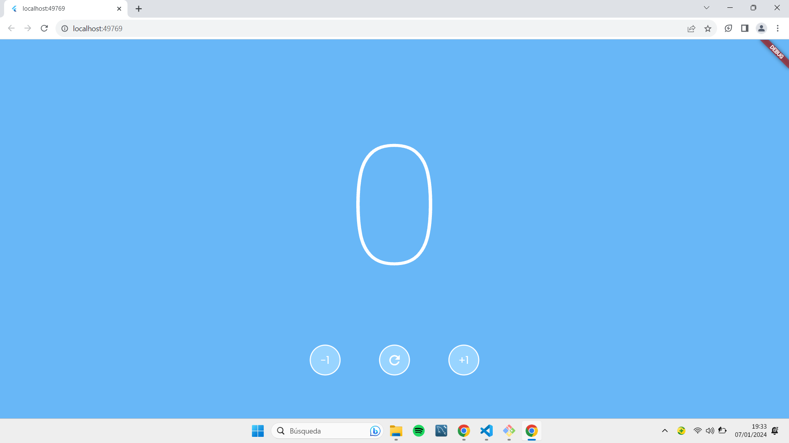

# Contador Flutter

fotos del ejercicio

## Estructura del Código

El código está dividido en dos partes: la definición del widget principal y las funciones relacionadas.

### Widget Principal

El widget principal se llama `MyWidget4`, que es un StatefulWidget. Aquí se inicializa un contador y se construye la interfaz de usuario.

- **Estado del Widget (`_MyWidget4State`):** Gestiona el estado del widget, incluyendo el valor del contador.

- **Método `build`:** Construye la interfaz de usuario utilizando un contenedor con un color de fondo, un texto grande que muestra el valor actual del contador y tres botones distribuidos en una fila.

- **Métodos `sumar`, `restar`, y `empezar`:** Actualizan el estado del contador según sea necesario.

- **Método `buildRoundButton`:** Genera un botón redondo con un texto y una función de devolución de llamada asociada.

- **Método `buildReloadButton`:** Genera un botón redondo con un ícono de recarga para reiniciar el contador.

### Estilo y Diseño

- **Color de Fondo:** Se utiliza un color azul claro para el fondo del contenedor.

- **Fuente y Estilo de Texto:** La fuente utilizada es 'Poppins' de Google Fonts. El texto del contador es grande y blanco.

- **Botones:** Los botones son redondos, con un color de fondo y borde específicos. Los botones de incremento y decremento ejecutan las funciones asociadas (`sumar` y `restar`), mientras que el botón de recarga ejecuta la función `empezar`.

